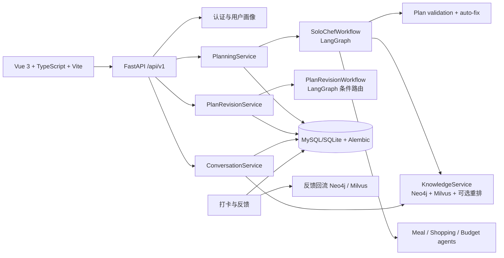

# SoloChef 项目交付评估与技术说明

> 版本：2026-08-18 代码审查版  
> 范围：`backend/`、`frontend/`、数据库迁移、AI/RAG 服务、测试与部署配置。

## 1. 结论先行

当前项目已经具备可演示的完整业务闭环，但**不建议直接作为生产版本交付**。前端可以交付给联调/验收环境：`vue-tsc`、18 个 Vitest 用例和 Vite 生产构建均通过。后端核心代码可以导入并运行，但全量测试仍有失败，且生产所需的外部依赖和持久化能力没有全部固化。

交付状态分级如下：

| 能力 | 状态 | 说明 |
|---|---|---|
| 注册、登录、刷新令牌、个人资料 | 已实现 | FastAPI + JWT + 数据库，会话由前端拦截器自动刷新 |
| 周计划生成 | 已实现/需验收 | 7 天 21 餐、RAG、三领域智能体、校验、预览、确认和版本化均有代码 |
| 计划调整 | 已实现/需验收 | `revision_intent` 条件路由，按餐食/采购/预算/约束/复合调整执行 |
| 购物清单 CRUD | 已实现 | 与当前计划采购记录关联；影响菜谱食材的结构性修改会返回 409，要求走调整计划 |
| 打卡、反馈、周报/日报 | 已实现 | 数据从计划餐食、打卡、反馈和采购记录计算，不应依赖前端固定文案 |
| SoloChef 问答和历史 | 已实现 | 普通 REST/SSE + RAG 对话服务，不属于 LangGraph 计划工作流 |
| 图片识别 | 已实现/可降级 | 视觉模型关闭时使用本地规则或演示结果；真实 VLM 需要密钥 |
| RAG | 已实现/依赖外部服务 | Neo4j 图谱 + Milvus 向量库；服务不可用时主链路降级 |
| 断点续传 | 部分实现 | LangGraph `InMemorySaver` 仅在当前进程有效，重启后丢失 |
| 生产交付 | 未就绪 | 需先修复后端测试失败、固定依赖服务、迁移策略和密钥配置 |

## 1.1 先看这一页：项目只有一条业务主线

不要先从 Agent 或 LangGraph 节点开始理解项目。先记住下面这条业务闭环：

```text
用户注册/登录
  -> 填写个人画像和营养目标
  -> 生成周计划（7 天 × 早中晚 = 21 餐）
  -> 预览并确认
  -> 保存计划版本、餐食和采购清单
  -> 用户执行：打卡、购买、反馈
  -> 生成日报/周报
  -> 反馈回流为长期记忆
  -> 下一次生成或调整计划时被 RAG 召回
```

系统只有两个计划工作流：

```text
生成计划：没有已有计划时，从画像和知识生成新计划
调整计划：已有计划时，根据用户修改要求生成新版本
```

“问 SoloChef”是独立的只读问答服务，不保存或修改计划；它可以读取画像、当前计划、对话历史和知识库，但不能替代计划生成/调整工作流。

## 1.2 数据从哪里来，最终写到哪里

| 数据来源 | 代表内容 | 首要存储 | 是否进入 RAG/Agent |
|---|---|---|---|
| 用户注册 | 手机号、密码、昵称、头像 | `users` | 否，作为身份与权限依据 |
| 用户填写画像 | 身体数据、忌口、偏好、预算、厨具、备餐时间 | `user_profiles` | 是，作为硬约束和检索过滤条件 |
| 营养计算 | BMR、TDEE、热量和三大营养素目标 | `nutrition_goals` | 是，供 planner/verifier 使用 |
| 知识文档/菜谱 | 菜谱、营养、食材、替代关系 | Milvus + Neo4j | 是，构成公共知识 RAG |
| 计划生成结果 | 21 餐、采购、预算、冲突 | `weekly_plans`、`plan_meal_items`、`plan_shopping_items` | 是，当前计划供问答和调整读取 |
| 用户执行 | 打卡、购买、实际价格、偏差 | `plan_meal_items`、`plan_shopping_items`、`expense_records` | 间接进入报告和反馈闭环 |
| 用户反馈 | 评分、原因、口味和执行偏差 | `plan_feedback` | 是，同步到 Neo4j/Milvus 成为长期记忆 |
| 对话 | 问题、回答、图片识别结果 | `chat_sessions`、`chat_messages` | 最近消息作为短期记忆 |

最重要的原则是：

```text
MySQL/SQLite = 业务事实主库
Neo4j = 实体关系和结构化记忆索引
Milvus = 语义向量检索索引
LangGraph = 一次任务的执行状态，不是业务主库
```

## 2. 系统架构



前端由 `frontend/src/router.ts` 负责页面路由，`api.ts` 统一封装认证、计划、购物、报告、问答、知识库和视觉识别接口；`AppShell.vue` 提供全局布局与导航。后端由 `app/main.py` 创建 FastAPI、挂载静态资源、初始化表和异步知识库 bootstrap；`app/api/router.py` 与 `auth_router.py` 暴露业务接口。

当前采用“两工作流 + 一个问答服务”的边界：

```text
WeeklyPlanWorkflow（SoloChefWorkflow）
  只负责生成周计划

PlanRevisionWorkflow
  只负责调整已有周计划，并在内部执行 revision_intent 条件路由

SoloChef Consultation Service（ConversationService）
  只负责普通问答、RAG、历史会话和图片识别，不进入计划生成/修改图
```

代码仓库中仍保留 `backend/app/ai/assistant_router.py`，它是早期“自由文本全局路由”方案的遗留实现，不应再作为现行入口调用。若要收敛代码，应在确认没有外部调用后删除该模块及对应的 `/assistant/intent` 兼容接口，或先标记 deprecated 并在一个版本周期后移除。

## 3. 业务流程

### 3.1 用户与画像

1. 用户注册/登录，获得 access token 与 refresh token。
2. 前端请求 `/profile`、`/profile/nutrition-goal` 读取身高、体重、目标、偏好、忌口、预算、厨具和备餐时长。
3. 用户更新画像后，营养服务按 TDEE 和目标类型计算热量、蛋白质、脂肪、碳水目标。
4. 画像与反馈会同步到图谱/向量知识层，供下一次规划检索。

### 3.2 周计划生成

```text
用户填写自然语言要求 + 预算
  -> PlanningService 载入画像、营养目标、反馈记忆
  -> constraint_parser 结构化预算/忌口/偏好/生活约束
  -> graph_retriever 与 vector_retriever 并行
  -> coordinator 合并 RAG 上下文
  -> meal_agent / shopping_agent / budget_agent 并行
  -> domain_coordinator 合并三领域结果
  -> planner 生成 7 天 × 3 餐 = 21 餐
  -> verifier 校验餐数、餐次、禁用食材、营养和预算
  -> final_planner 输出预览结果
  -> 用户确认后保存 WeeklyPlan、MealItem、ShoppingItem 和 AgentRun
```

生成工作流源码在 `backend/app/ai/workflow.py`，实际技术节点为 12 个（含三个并行领域节点）；产品展示可以将检索、领域智能体和校验收敛为业务节点，但实现层不能删除这些依赖关系。现行计划工作流共两条：生成工作流和调整工作流；问答服务不计入 LangGraph 工作流数量。

### 3.3 计划调整

```text
用户在计划页输入调整要求
  -> 解析 ReviseOperation
  -> revision_intent 条件路由
       adjust_meal / adjust_shopping / update_budget
       adjust_macro_target / exclude_ingredient / compound
  -> 选中分支执行局部重算
  -> affected_agents 暴露受影响领域
  -> dependency_sync 标记餐食-采购-预算依赖已同步
  -> verifier 产生差异、冲突和预算结果
  -> 前端展示新旧版本预览
  -> 用户确认后创建新版本；取消则不改变当前版本
```

调整菜谱通常会改变采购条目和估价；仅修改采购的购买状态、实际价格等安全字段不会重生成菜谱。删除或替换会影响餐食原料的结构性操作会被后端保护并引导回调整工作流。

### 3.4 购物、打卡与报告

- `/shopping` 读取当前活动计划的采购记录，CRUD 直接作用于同一批记录。
- 结构性修改先调用 `/shopping/{id}/impact`；若影响餐食，后端返回 409，前端展示受影响菜谱并跳转调整预览。
- 餐食打卡写入 `plan_meal_items` 的状态、偏差类型和原因；反馈写入 `plan_feedback`。
- 周报按选择的周起始日聚合计划餐食、完成餐数、营养摄入、预算和反馈；无计划时应显示空状态，不应展示伪造的“已达成”数据。

### 3.5 SoloChef 问答与图片识别

问答使用 `ConversationService`，通过会话、消息、事件表保存历史，支持普通响应和 SSE 流式响应。服务将对话上下文、用户画像、当前计划和 RAG 结果拼接后调用 LLM；它是只读咨询入口，不负责保存或修改周计划。图片上传走 `/chat/vision`，由视觉服务识别食材/菜品/营养信息，识别结果回填到对话框，用户仍可追加问题后发送。

## 4. 功能模块与技术实现

| 模块 | 关键代码 | 实现原理 |
|---|---|---|
| 认证 | `api/auth_router.py`, `services/auth.py`, `models/identity.py` | JWT 短期 access token + refresh session；Axios 401 拦截器刷新令牌 |
| 画像/营养 | `services/nutrition.py`, `NutritionGoalView.vue` | TDEE、宏量营养分配和目标校验；结果持久化到 `nutrition_goals` |
| 计划 | `services/planning.py`, `ai/workflow.py` | LangGraph 状态图、结构化 Pydantic 输出、自动降级 DemoPlanGenerator |
| 计划调整 | `services/plan_revise.py`, `ai/revision_workflow.py` | 解析操作、条件边、差异预览、确认后新版本 |
| 领域智能体 | `ai/domain_agents.py` | 餐食、采购、预算输出结构化约束；默认规则引擎，配置开启后可调用 LLM |
| 校验 | `services/plan_validation.py` | 21 餐/餐次、禁用词、营养目标、预算、时长和硬冲突检查；部分冲突可自动修复 |
| 知识库 | `services/knowledge.py`, `documents.py` | 文档切块、向量写入、实体关系抽取、同步状态与离线评测 |
| 图谱 | `services/graph_store.py` | Neo4j 保存用户画像、菜谱、食材、营养和反馈关系，按 user_id 隔离 |
| 向量检索 | `services/milvus_store.py`, `embeddings.py`, `reranker.py` | Milvus ANN 召回；BGE-M3 可选 1024 维 embedding；可选 bge-reranker-v2-m3 二阶段重排 |
| 对话 | `services/conversation.py`, `repositories/conversations.py` | 会话/消息持久化，SSE 事件可重放，支持取消和历史删除 |
| 购物一致性 | `router.py`, `services/substitution.py` | 估价来自当前采购记录；影响餐食的变更阻断，避免静默产生不一致 |
| 报告 | `services/weekly_report.py`, `WeeklyReportView.vue` | 按周起始日聚合真实计划、打卡、反馈和费用；支持周期列表切换 |
| 前端 | `frontend/src/views`, `components`, `styles` | Vue 组合式 API、Pinia 会话状态、可复用资源/Toast composable、响应式布局 |

## 5. Agent、工作流与 AI 技术拆解

### 5.1 LangGraph 状态与节点

`SoloChefWorkflow` 使用 `StateGraph(WorkflowState)`。状态包含请求、画像约束、RAG 命中、领域结果、草稿、冲突、自动修复、来源和执行 trace。图边明确表达并行和汇聚：图谱/向量检索并行，三领域智能体并行，之后由协调节点合并。

当前不再使用全局 `AssistantRouterWorkflow`。它曾经把自由文本分类为周计划、采购、预算、咨询或局部调整，但会让“问 SoloChef”承担计划入口职责，造成产品边界和工作流数量混乱。因此它只作为遗留兼容代码记录，不属于现行业务流程。

`PlanRevisionWorkflow` 是调整入口的唯一业务路由器。`revision_intent` 根据 `ReviseOperation.operation` 选择单一分支，随后显式记录受影响的 agent 能力和依赖同步状态。周计划生成本身不需要再次做全局意图识别，因为入口已经由页面动作确定为“生成计划”。

### 5.2 三领域智能体为什么存在

- 餐食智能体负责餐次覆盖、菜谱约束、忌口、烹饪时长和营养结构。
- 采购智能体负责食材合并、单位、采购批次、替代与采购策略。
- 预算智能体负责类别限额、预留金额、估价和超预算风险。

三个智能体输出结构化结果，再由 `domain_coordinator` 统一合并。这样做是为了让每个领域有清晰的约束边界，降低单一大提示词同时处理菜谱、采购和金额时的遗漏；最终仍由统一 planner 和 verifier 负责一致性，而不是让 agent 直接互相覆盖数据库。

### 5.3 RAG、实体抽取和记忆

RAG 分两路：Neo4j 召回关系事实，Milvus 召回语义片段，`coordinator` 将二者组成上下文。文档入库时 `entity_extractor.py` 默认使用本地正则抽取“类型:值”实体；只有 `entity_extraction_llm_enabled=true` 且真实 LLM 可用时才使用 JSON 格式 LLM 抽取，失败自动回退。因此实体抽取失败不应阻断知识入库，但复杂自然语言关系可能丢失，需要后续人工评测。

Embedding 默认走可用的轻量后端；配置本地 BGE-M3 路径后才启用 BGE-M3。模型不应在生产启动时隐式联网下载。重排同样是可选增强。

#### RAG 的完整读写链路

```text
文档/画像/反馈
  -> 文档解析与切块
  -> embedding（默认轻量模型，可配置 BGE-M3）
  -> Milvus 向量集合
  -> entity_extractor 抽取实体/关系
  -> Neo4j Document/实体/关系

用户查询
  -> query_rewriter 识别关键词、实体类型和关系
  -> Milvus 召回候选片段
  -> 可选 reranker 二阶段重排
  -> Neo4j 查询用户画像、食材、菜谱和反馈关系
  -> coordinator 合并上下文
  -> planner 或 ConversationService 调用 LLM
```

知识文档入库由 `KnowledgeService.bootstrap()` 或文档上传接口触发。向量库保存文档名、类别、用户隔离标识、chunk index、内容和向量；图谱保存文档节点、实体节点以及关系边。查询时必须带 `user_id` 过滤，避免不同用户的画像和反馈互相召回。RAG 失败时，计划工作流记录 warning 并继续使用规则/模型的可用上下文，问答服务返回空 snippets 后仍可回答。

#### BGE-M3 的实际实现

项目已经有 BGE-M3 适配，但它是可选增强，不是所有环境默认都在使用：

1. `services/embeddings.py:create_embedding_backend()` 根据 `embedding_provider` 选择模型。`auto`/`bge-m3` 会先尝试 BGE-M3，失败后回退；`default` 直接使用轻量模型。
2. `_try_bge_m3()` 通过 `sentence_transformers.SentenceTransformer` 加载 `BAAI/bge-m3` 或 `embedding_model_path` 指定的本地目录，使用 `normalize_embeddings=True` 输出归一化向量。
3. 模型加载使用 `local_files_only=True`，不会在 API 启动期间隐式下载多 GB 模型。没有本地权重、依赖缺失或模型加载失败时，记录 warning 并回退到 `all-MiniLM-L6-v2`。
4. BGE-M3 向量维度固定为 1024；轻量 fallback 为 384 维。`MilvusVectorStore` 根据 `is_bge_m3` 选择不同集合名：BGE-M3 使用带 `_bge_m3` 后缀的集合，避免 1024 维和 384 维向量混写。
5. `MilvusVectorStore.embedding_model_name`、集合维度和知识库状态接口可用于确认当前进程实际使用的模型；配置写了 BGE-M3 不代表模型已经成功加载。

推荐生产配置：预先下载并校验 BGE-M3 到本地模型目录，设置 `EMBEDDING_PROVIDER=bge-m3`、`EMBEDDING_MODEL_PATH=...`，启动前执行一次索引重建。切换 384 维与 1024 维模型时必须使用新集合并全量重嵌入，不能直接复用旧集合。

#### 长期记忆的数据库与索引操作

长期记忆不是一张名为 memory 的表，而是业务事实 + 检索索引的组合：

| 记忆内容 | MySQL/SQLite 主表 | 写入时机 | 读取时机 |
|---|---|---|---|
| 用户身体、偏好、忌口、预算、厨具 | `user_profiles` | `/profile` 更新 | 生成计划、问答只读上下文 |
| 营养目标快照 | `nutrition_goals` | 计算营养目标 | verifier、报告、问答 |
| 已生成计划及版本关系 | `weekly_plans` | 计划确认/调整确认 | 当前计划、版本历史、报告 |
| 餐食执行状态 | `plan_meal_items` | 打卡、偏差反馈 | 报告、下一次规划 |
| 采购执行状态 | `plan_shopping_items`, `expense_records` | 购买/价格/支出操作 | 预算、报告、计划详情 |
| 主观与客观反馈 | `plan_feedback` | 反馈接口、自动打卡回流 | 反馈统计和下一轮规划 |

反馈写入 `plan_feedback` 后，`FeedbackLoop` 会调用图谱同步和向量写入；两个布尔字段 `synced_to_graph`、`synced_to_vector` 是补偿依据。外部索引不可用时，业务记录仍提交到数据库，标志保持 false；后台补偿任务通过 `pending_sync()` 找出未完成记录，再调用 `replay()` 重放，成功后更新对应标志。这保证长期记忆的主事实不依赖 Neo4j/Milvus 的瞬时可用性。

#### 短期记忆的数据库与运行时操作

问答短期记忆由 `chat_sessions` 和 `chat_messages` 组成：

1. 创建会话：插入 `chat_sessions(id, user_id, title, status='active')`。
2. 用户发送消息：插入 `chat_messages(role='user', content, session_id, user_id)`，并更新会话 `updated_at`。
3. 生成回答：读取该会话最近 8 条 user/assistant 消息，和画像、营养目标、当前计划、RAG 片段一起组成 prompt。
4. 回答完成：插入 `chat_messages(role='assistant')`，会话状态恢复为 `active`。
5. 流式回答：token 不逐字写数据库，而是写入运行时事件缓存；完成时只持久化完整 assistant 消息。
6. 历史恢复：按 `session_id + user_id` 查询，消息使用 `selectinload` 一次加载。
7. 删除会话：删除 `chat_sessions`，由外键级联删除 `chat_messages`。

SSE 事件由 `runtime_state` 在进程内保存 event id、事件类型和 turn 状态。客户端断线时通过 `/chat/sessions/{id}/events?after=...` 重放尚未收到的事件；这属于短期流式事件恢复，不等同于长期记忆。

记忆分为三层：

1. **短期记忆**：对话会话消息和 LangGraph 当前 thread 的状态。
2. **长期记忆**：用户画像、营养目标、打卡反馈持久化在业务数据库，并回流到 Neo4j/Milvus，下一次检索可召回。
3. **检查点**：当前使用 `InMemorySaver`，只保证同一进程内失败恢复；不是跨重启的长期工作流记忆。

### 5.4 断点续传与检查点

计划生成的断点机制由两条记录链共同组成：

```text
LangGraph InMemorySaver
  保存完整 StateGraph 状态（当前进程内）

agent_runs
  保存可审计的运行摘要、节点 trace、状态、错误和 checkpoint JSON
```

具体操作如下：

1. 开始生成时，`PlanningRepository.create_agent_run()` 插入 `agent_runs`，状态为 `running`。
2. 每个节点完成后，`persist_step()` 调用 `update_agent_run()`，更新 `steps`/trace，并写入：
   `checkpoint.last_completed_node`、节点输出摘要、`resumable=true` 和更新时间。
3. 正常结束时，保存完整计划响应到 `payload`，状态改为 `completed`，并将 `resumable=false`。
4. 异常结束时，保存 `error_message`、`error_type`、`failed_step`，状态改为 `failed`，保留最后一个可恢复节点。
5. 调用恢复接口时，只允许恢复 `failed` 的 run；服务重新配置同一个 checkpointer 和 `thread_id=run_id`，然后调用 `workflow.run(..., resume=True)` 从 LangGraph 状态继续。
6. 恢复成功更新状态为 `completed`；恢复再次失败则保留错误和 `resume_failed_at`，避免伪造成功。

`agent_runs` 的关键字段是：`id`、`user_id`、`status`、`prompt`、`payload`、`steps`、`sources`、`error_message`、`failed_step`、`checkpoint`、`started_at`、`finished_at`。`weekly_plans.run_id` 外键将最终计划和一次 Agent Run 关联起来，便于审计。

当前限制：`checkpoint` JSON 只保存摘要，完整 LangGraph 状态在 `InMemorySaver`；因此服务重启、水平扩容到另一进程或容器替换后，数据库里虽然还有“可恢复”标志，但没有完整图状态可继续。生产方案应将 LangGraph saver 替换为 Redis/数据库持久化实现，并在恢复前校验 `user_id`、计划版本和幂等键，避免重复创建计划或重复扣减库存。

### 5.5 工具调用与多智能体边界

当前“工具调用”主要是后端服务调用：数据库仓储、Neo4j/Milvus 检索、营养计算、替代推荐、视觉模型和 LLM API。领域 agent 并不是拥有任意数据库写权限的自主代理；它们产生结构化建议，由服务层 verifier、预览和确认流程控制写入。这种边界可审计、可回滚，也避免模型直接破坏活动计划。

## 6. 设计取舍与原因

- **预览后确认**：计划生成和调整都可能改变 21 餐、采购和预算，先预览可以让用户发现冲突，确认后才创建版本。
- **版本化而不是覆盖**：保留历史、支持激活/回滚/比较，便于纠错和报告追溯。
- **购物影响保护**：购物数据与计划采购共享记录，因此结构性修改必须显式进入调整工作流，防止菜谱和清单静默不一致。
- **外部依赖可降级**：Neo4j、Milvus、LLM、视觉模型不可用时，基础计划和问答仍可使用本地规则/演示生成，提升开发环境可启动性；生产环境必须监控降级状态。
- **只读问答**：SoloChef 咨询不直接修改计划，避免自由文本误触发高影响写操作；需要生成计划时进入生成页面，需要改计划时进入调整入口。

## 7. 残留文件与清理结果

已清理确认属于生成物的根目录/后端缓存、测试临时目录、前端 `dist` 构建目录和两份营养 JSON 备份。以下内容没有删除：

- `backend/app/data/knowledge_docs`、菜谱、食材替代和静态资源：它们是 RAG/页面运行数据。
- Alembic migration：数据库演进必需。
- `node_modules`、`.venv`：本机开发运行依赖，交付打包时由安装步骤排除。
- 多份历史 Markdown/HTML：存在用户手工维护或项目说明价值，未在无法确认内容归属时强行删除。

建议后续把历史说明文档归档到 `docs/archive/`，只保留本文作为交付基线，并在 CI 中检查新增大文件、数据库文件和构建产物。

## 8. 已知问题、风险与解决方案

| 问题/风险 | 影响 | 解决方案 |
|---|---|---|
| 全量后端测试存在失败 | 不能证明回归稳定 | 修复计划校验失败断言；为分段生成注入 fake model，测试不得读取真实 `.env` LLM 配置 |
| Windows pytest 临时目录权限 | 部分测试无法 setup | CI 使用 Linux；本地设置可写 `TEMP/TMP` 或 pytest `--basetemp` 到项目临时目录 |
| InMemorySaver 重启丢检查点 | 生产无法跨进程恢复 | 接入 Redis/数据库 checkpoint saver，并用 run_id + user_id 做隔离和幂等恢复 |
| 遗留全局路由仍被调用 | “问 SoloChef”可能误进入计划入口，工作流职责重复 | 停止调用 `AssistantRouterWorkflow`，将咨询固定到 `ConversationService`；保留一个版本的兼容接口后删除 |
| 真实 LLM/VLM/API 密钥缺失或过期 | 进入降级模式或 401 | 启动时健康检查、明确 `demo/degraded/ready` 状态，密钥通过 Secret 管理，不写入 `.env` |
| Neo4j/Milvus 不可用 | RAG 召回为空，质量下降 | 依赖探针、bootstrap 重试、离线索引构建、监控召回率和降级告警 |
| 默认实体抽取为正则 | 复杂关系召回弱 | 增加结构化抽取测试集、LLM 抽取 JSON 校验和人工抽样评估 |
| 迁移与启动 `create_all` 并存 | 生产 schema 演进可能被掩盖 | 生产只执行 `alembic upgrade head`，启动时禁止静默吞掉数据库错误 |
| 前端主 CSS chunk 较大 | 首屏性能 | 继续拆分 Element Plus/ECharts，按路由懒加载并做 gzip/brotli |
| 预算/营养结果依赖真实记录 | 空计划时不能展示伪造数据 | 所有首页、报告和计划摘要使用“无活动计划/无数据”空状态，并增加 API contract tests |
| 图片上传和 SSE | 大文件、断线、重复发送 | 限制尺寸和频率；使用事件 ID 重放；服务端保存 turn 状态并支持取消 |

## 9. 交付前检查清单

- [ ] 配置生产数据库、Redis checkpoint、Neo4j、Milvus 和对象/静态资源存储。
- [ ] 将 JWT secret、LLM/VLM key、数据库密码移出 `.env`，使用部署平台 Secret。
- [ ] 修复后端全量测试失败并让 CI 从干净环境通过。
- [ ] 执行 `alembic upgrade head`，验证新库和升级库均能启动。
- [ ] 建立知识库 bootstrap/indexing 作业，不在 API 启动线程中隐式下载模型。
- [ ] 验证 21 餐生成、预算超限、忌口冲突、调整预览、确认/取消/回滚、购物 409 保护和报告空状态。
- [ ] 做真实 LLM/VLM、Milvus、Neo4j 不可用时的降级演练。
- [ ] 通过前端 `npm run typecheck && npm run test && npm run build`。
- [ ] 通过后端 `python -m compileall`、`pytest`、RAG 离线评测和迁移检查。

## 10. 当前验证记录

- 前端 `npm.cmd run typecheck`：通过。
- 前端 Vitest：3 个测试文件、18 个测试通过。
- 前端 Vite production build：通过；存在 chunk 大小警告。
- 后端 `compileall`：通过。
- 后端全量 pytest：未通过。已确认包含临时目录权限错误、计划校验用例失败、分段规划测试触发真实 LLM 401；因此当前结论为“可联调/可演示，暂不生产交付”。
